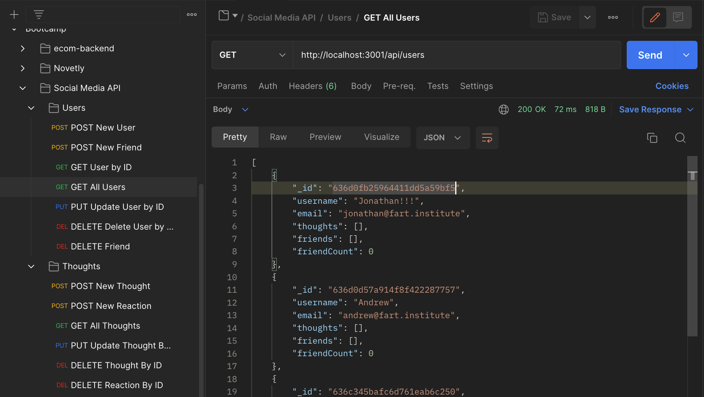

# 18-Social-Network-API

## Table of Contents:

[1. Description](#Description)

[2. Walkthrough](#Walkthrough-Videos)

[3. Installation](#Installation)  

## Description

This is the week 18 project "Social Media API" that uses MongoDB for it's database, Moment for date formatting, and Express.js for routing.

User Story:

```text
AS A social media startup
I WANT an API for my social network that uses a NoSQL database
SO THAT my website can handle large amounts of unstructured data
```

## Walkthrough

[Video Walkthrough](https://watch.screencastify.com/v/8eAnY1kFLoNBfrLp82Wn)



## Installation

This app is not deployed. To run locally:

1. Clone the repo

2. Install MongoDB, and connect to the database
3. Run the following commands:

```text
    - npm init -y
    - npm install express
    - npm install mongoose
    - npm install moment
```

4. Start the server

```javascript
    $ npm start
```

5. Open your REST client of choice to test API routes
